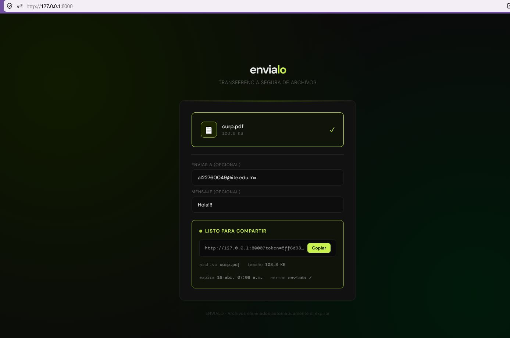
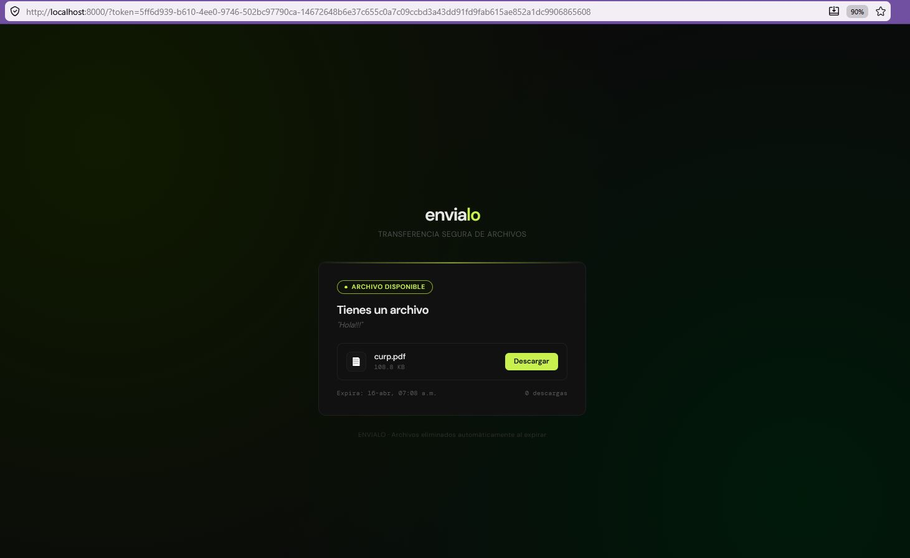
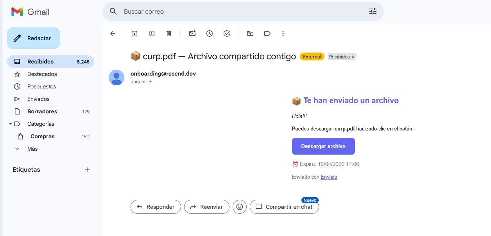

# 📦 Envialo

> Un clon de WeTransfer de alto rendimiento construido con FastAPI, PostgreSQL y Supabase.  
> Sube archivos, compártelos mediante enlaces seguros y notifica al destinatario por correo electrónico.


---

## 📋 Tabla de contenidos

- [Características clave](#-características-clave)
- [Arquitectura](#-arquitectura)
- [Stack tecnológico](#-stack-tecnológico)
- [Endpoints de la API](#-endpoints-de-la-api)
- [Seguridad implementada](#-seguridad-implementada)
- [Instalación rápida](#-instalación-rápida)
- [Variables de entorno](#-variables-de-entorno)
- [Worker de limpieza](#-worker-de-limpieza)
- [Estructura del proyecto](#-estructura-del-proyecto)
- [Screenshots](#-screenshots)
- [Créditos](#-créditos)

---

## ✨ Características clave

- ⚡ **Alta velocidad** – Subidas y descargas optimizadas con URLs firmadas.
- 🔒 **Seguro por diseño** – Validación MIME real, tokens únicos, expiración de enlaces.
- 📧 **Notificaciones por email** – Envía al destinatario el enlace de descarga.
- 🧹 **Limpieza automática** – Worker que elimina archivos expirados.
- 🐳 **Listo para producción** – Docker, migraciones Alembic y configuración por entorno.
- 📊 **Auditoría completa** – Logs de todas las transferencias en Supabase.

---

## 🧠 Arquitectura
Frontend (HTML/JS)
↓
API Routes (FastAPI)
↓
Servicios (lógica de negocio)
↓
Repositorios (acceso a datos)
↓
PostgreSQL (metadatos) + Supabase Storage (archivos)


---

## 🛠 Stack tecnológico

| Capa            | Tecnología                          |
|----------------|-------------------------------------|
| Backend        | Python 3.11 + FastAPI               |
| Base de datos  | PostgreSQL (Docker)                 |
| Almacenamiento | Supabase Storage                    |
| Logs           | Supabase (`audit_logs`)             |
| Correos        | Resend                              |
| Frontend       | HTML + CSS + JS vanilla             |
| Contenedores   | Docker + Docker Compose             |
| Migraciones    | Alembic                             |
| Worker         | APScheduler                         |

---

## 📡 Endpoints de la API

| Método   | Ruta                          | Descripción                                |
|----------|-------------------------------|--------------------------------------------|
| `POST`   | `/api/v1/upload`              | Sube archivo(s) y retorna un token único. |
| `GET`    | `/api/v1/download/{token}`    | Genera URLs firmadas para descarga.       |
| `GET`    | `/api/v1/file/{token}`        | Obtiene metadatos del transfer.           |
| `DELETE` | `/api/v1/file/{token}`        | Elimina transfer y archivos asociados.    |
| `GET`    | `/health`                     | Verifica el estado de la aplicación.      |

---

## 🔐 Seguridad implementada

- ✅ Validación de **MIME real** con `magic bytes` (no confiar en extensiones).
- ✅ Protección contra **path traversal**.
- ✅ Bloqueo de **scripts ejecutables** (`.exe`, `.bat`, `.sh`, etc.).
- ✅ Tokens seguros generados con `UUID` + `secrets`.
- ✅ Límite de tamaño configurable (por defecto 100 MB).
- ✅ Manejo de errores HTTP: `413`, `415`, `404`, `410`.
- ✅ **URLs firmadas** de Supabase (expiran en 1 hora, sin exposición directa).

---

## 🚀 Instalación rápida

### Requisitos previos

- Python 3.11+
- Docker Desktop
- Git
- Cuenta en [Supabase](https://supabase.com)
- Cuenta en [Resend](https://resend.com)

### Paso a paso

```bash
# 1. Clonar el repositorio
git clone https://github.com/AleRodriguezCruz/envialo.git
cd envialo

# 2. Configurar variables de entorno
cp .env.example .env

# 3. Configurar Supabase (ejecutar script en SQL Editor)
# Ir a scripts/setup_supabase.sql

# 4. Instalar dependencias
pip install -r requirements.txt

# 5. Levantar PostgreSQL con Docker
docker compose up postgres -d

# 6. Ejecutar migraciones
python -m alembic upgrade head

# 7. Iniciar la aplicación
python -m uvicorn app.main:app --reload --port 8000

## 🚀 Disponibilidad de la App

Una vez iniciada, puedes acceder a los siguientes servicios:

* **Frontend:** [http://localhost:8000](http://localhost:8000)
* **Swagger UI (Documentación):** [http://localhost:8000/docs](http://localhost:8000/docs)
* **Health Check:** [http://localhost:8000/health](http://localhost:8000/health)

---

## 🔧 Variables de Entorno

| Variable | Descripción | Valor por defecto |
| :--- | :--- | :--- |
| `APP_ENV` | Entorno (development/production) | `development` |
| `APP_PORT` | Puerto del servidor | `8000` |
| `MAX_FILE_SIZE` | Tamaño máximo (bytes) | `104857600` (100 MB) |
| `TRANSFER_EXPIRY_HOURS` | Horas hasta expiración | `72` |
| `CLEANUP_INTERVAL_HOURS` | Intervalo del worker de limpieza | `6` |
| `POSTGRES_HOST` | Host de PostgreSQL | `localhost` |
| `SUPABASE_URL` | URL del proyecto Supabase | — |
| `RESEND_API_KEY` | API key de Resend | — |

---

## 🧹 Worker de Limpieza

El worker se ejecuta automáticamente cada `CLEANUP_INTERVAL_HOURS` horas y realiza las siguientes acciones:
1.  **Elimina** archivos expirados de Supabase Storage.
2.  **Marca** los transfers como eliminados en PostgreSQL.

### Ejecución manual:
Si necesitas forzar la limpieza, ejecuta:
```bash
python scripts/run_worker.py

##📁 Estructura del proyecto
envialo/
├── app/
│   ├── api/            # Controladores y rutas
│   ├── core/           # Configuración, seguridad, excepciones
│   ├── db/             # Modelos SQLAlchemy y conexión
│   ├── repositories/   # Patrón Repository (acceso a datos)
│   ├── services/       # Lógica de negocio
│   └── workers/        # Tareas en segundo plano
├── frontend/           # Interfaz de usuario (HTML/JS/CSS)
├── migrations/         # Scripts de Alembic
├── scripts/            # Utilidades y automatización
└── screenshots/        # Imágenes para el README

---

## 📸 Screenshots

### Interfaz de subida


### Interfaz de descarga


### Notificación por correo


---

## 👥 Créditos

Este proyecto fue desarrollado con un enfoque educativo por:

* **Alejandra Rodríguez de la Cruz** - [GitHub](https://github.com/AleRodriguezCruz)
* **Flor Jazmín Mayon Cisneros**

---

## 📄 Licencia y Seguridad

Este proyecto es de **uso educativo**. 

### 💡 ¿Por qué URLs firmadas?
Los archivos nunca se exponen directamente. Cada URL de descarga expira en **1 hora**, evitando accesos no autorizados incluso si el enlace es interceptado.

---

¿Preguntas o sugerencias? Abre un **issue** o contáctanos.